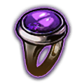

# Job vs Reward vs Tileset

It is reasonably well documented, the linking between jobs, an tilesets, which can be checked by searching jobs and contract types.
Also, there are some guides which describe the linking between jobs and reward options, although they are not always consistent.

***Note*** Contracts can be `5->1`ed at the vendor if they are either all rare or all magic (not normal) and the same tileset. This paired with the tileset vs. job means you can, if it's valuable enough to you, 5 to 1 looking for better jobs. E.g., If you only wanted Deception contracts you could consult the Tileset vs. Job table and note that on Mansion, Records Office, Smuggler's Den, Underbelly, Laboratory, and Prohibited Library non deception jobs could be `5->1`ed to fish for deception.

***This is my best effort as of 3.20***

# Tileset vs Job

***Note*** Safes indicates if the contract/blueprint has a pair of safes in the reward room.

| Tileset | Jobs | Safes | Blueprint Reward 
| ---                | --- | --- | --- |
| Bunker             | Agility, Counter-Thaumaturgy, Demolition, Engineering, Lockpicking, Perception, Trap-Disarm | Contract, Blueprint | Enchanted Armaments |
| Mansion            | Agility, Brute Force, Deception, Lockpicking, Perception | Contract, Blueprint | Enchanted Armaments |
| Records Office     | Brute Force, Counter-Thaumaturgy, Deception, Demolition, Lockpicking, Trap-Disarm | Contract, Blueprint | Enchanted Armaments |
| Smuggler's Den     | Brute Force, Deception, Demolition, Perception, Trap-Disarm | None | Thieves' Trinkets or Currency |
| Underbelly         | Agility, Brute-Force, Deception, Demolition, Engineering | Blueprint |Thieves' Trinkets or Currency |
| Repository         | Agility, Demolition, Lockpicking, Perception, Trap-Disarm | None | Unusual Gems |
| Tunnels            | Agility, Brute-Force, Counter-Thaumaturgy, Demolition, Engineering, Trap-Disarm | None | Unusual Gems |
| Laboratory         | Counter-Thaumaturgy, Deception, Demolition, Perception | Blueprint | Replicas or Experimented Items |
| Prohibited Library | Counter-Thaumaturgy, Deception, Engineering, Lockpicking, Perception | Blueprint | Replicas or Experimented Items |

# Job vs Rewards

| Job         | Rewards |
| ---         | ---     |
| Agility     |  Armor, Currency, Essences, Fossils, Harbinger |
| Brute Force | Fossils, Uniques, Weapons |
| Counter-Thaumaturgy | Accessories, Currency, Gems |
| Deception   | Armor, Divination, Harbinger |
| Demolition  | Blight, Delirium, Generic, Metamorph |
| Engineering | Essences, Generic, Maps, Uniques |
| Lockpicking | Accessories, Currency, Fragments |
| Perception  | Accessories, Divination, Generic |
| Trap-Disarm | Abyss, Armor, Breach, Legion, Talismans, Weapons |

# Tileset vs Reward

***Note*** The number in each column indicates the number of jobs which could spawn that reward room. It is likely there are more factors which impact the likelihood of certain rewards appearing.

| Tileset            |  |  |  |  |  |  |  |  |  |  |  |  |   |   |  |  |   |  |  |  
| ---                | --- | ---| --- | --- | --- | --- |  --- | --- | --- | --- | --- | ---| --- | --- | --- | --- |  --- | --- | --- | --- |
| Bunker             | 1 | 3 | 2 | 1 | 1 | 3 | 1 | 1 | 2 | 1 | 1 | 1 | 3 | 1 | 1 | 1 | 1 | 1 | 1 | 1 |
| Mansion            |  | 2 | 2 |  |  | 2 |  | 2 | 1 | 1 | 2 |  | 1 | 2 |  |  |  |  | 1 | 1 |
| Records Office     | 1 | 2 | 2 | 1 | 1 | 2 | 1 | 1 |  | 1 | 1 | 1 | 1 | 1 | 1 |  | 1 | 1 | 1 | 2 |
| Smuggler's Den     | 1 | 1 | 2 | 1 | 1 |  | 1 | 2 |  |  | 1 |  | 2 | 1 | 1 |  | 1 | 1 | 1 | 2 |
| Underbelly         |  | 1 | 2 | 1 |  | 2 | 1 | 1 | 2 |  | 2 | 1 | 2 | 2 |  | 1 | 1 |  | 2 | 1 |
| Repository         | 1 | 2 | 2 | 1 | 1 | 2 | 1 | 1 | 1 | 1 | 1 |  | 2 | 1 | 1 |  | 1 | 1 |  | 1 |
| Tunnels            | 1 | 1 | 2 | 1 | 1 | 2 | 1 |  | 2 |  | 2 | 1 | 2 | 1 | 1 | 1 | 1 | 1 | 2 | 2 |
| Laboratory         |  | 2 | 1 | 1 |  | 1 | 1 | 2 |  |  |  | 1 | 2 | 1 |  |  | 1 |  |  |  |
| Prohibited Library |  | 3 | 1 |  | 0 | 2 |  | 2 | 1 | 1 |  | 1 | 2 | 1 |  | 1 |  |  | 1 |  |