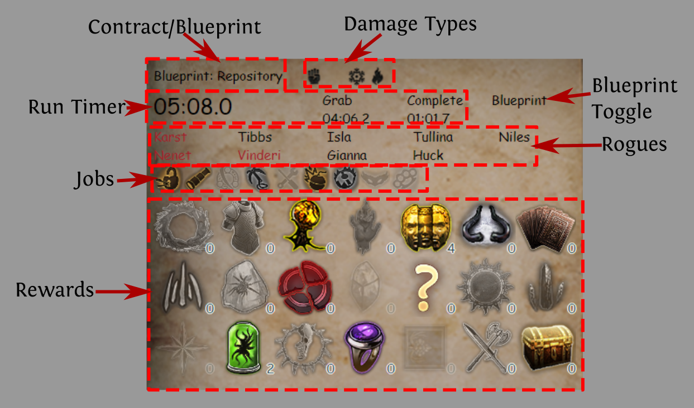
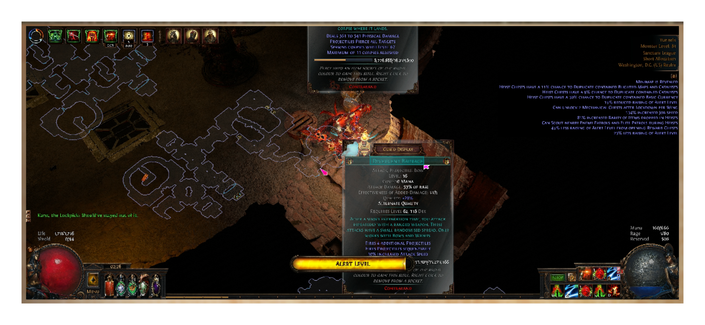
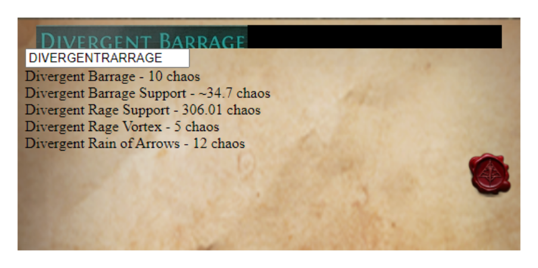
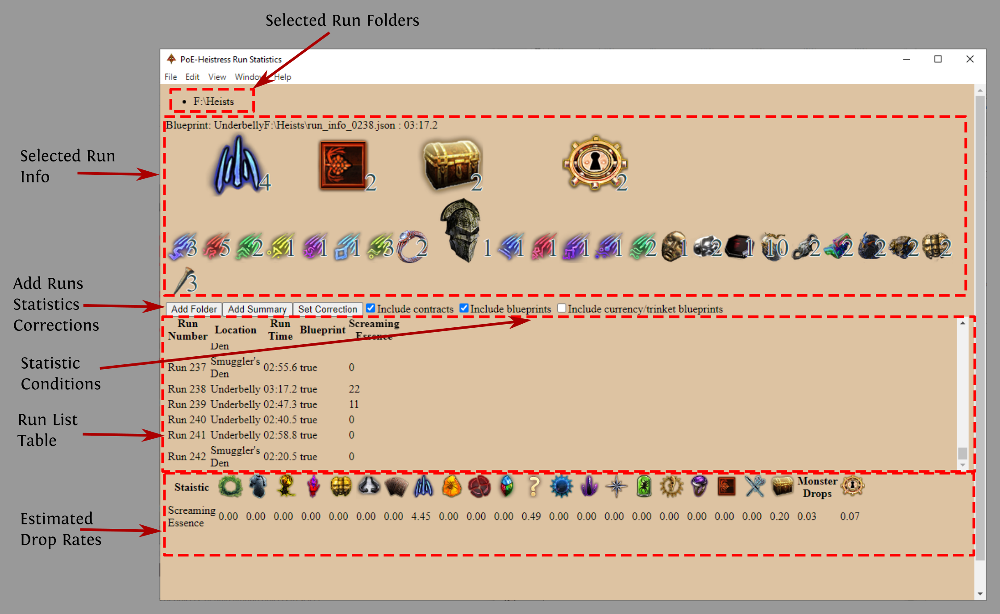

# PoE - Heistress

***This product isn't affiliated with or endorsed by Grinding Gear Games in any way.***

Heistress will run in the tray, and windows can be hidden/shown by right clicking the tray icon and selecting the associated window name.

It contains two main features
- Tracking - If you are running heist and want to track how long runs take and/or how valuable certain loot rooms are.
- Pricing - If you want to price the curio loot via optical character recognition OCR and `poe.ninja`.

## Installing

See the releases.

## Strategy Notes

[Blueprint Reveal](Blueprints.md)

[Jobs, Rewards, Tilesets](JobsVsRewardsVsTileset.md)

[Reward Chests](RewardChests.md)

# Tracking Window
One of the main features of Heistress is aiding in the tracking of heist contract/blueprint running. It can watch your `Client.txt` for events like entering/leaving heist areas and rogue dialog to track your progress.

Also, it can pull your inventory from the Path of Exile website at the start and end of a heist and produce a summary of your loot so you can estimate what reward rooms are worth.

The screen looks as follows, and when active will remain on the top.

***Note***: Moving the window can be accomplished by clicking and holding on a section of the window which is not occupied, the top right corner for instance.

## Contract/Blueprint

The contract/blueprint line tracks which contract/blueprint you are currently running. It is triggered off the name of the area you joined. Upon triggering it will show which damage types this area is noteworthy for (physical, cold, and fire here), decrease the transparency of the jobs which can spawn in the area (lockpicking, perception, agility, demolition, and trap disarmament here), and start the timer.

***Note***: There is no difference in the area name of blueprints/contracts having more than 1 rogue auto sets the blueprint flag or the blueprint flag can be toggled on/off with the blueprint toggle.

***Note***: It only triggers on the higher level contract/blueprints.

## Timer

The timer shows 3 times, this is completely automated.

- *Main* The first and largest timer is the current elapsed time in the heist. This is automatically triggered upon entering the heist.
- **Grab** Is the time until you grab the target. This is automatically triggered by rogue line.
- **Complete** The time from grab to exiting the heist.

***Note***: Tullina does not use her voice lines upon grabbing the target so the timer will not toggle.

***Note***: Blueprint wings are all technically in the same area. If you want to track per wing, you must leave the area.

## Rogues

This shows the currently tracked rogues. This is relevant if you are trying to determine loot drop rates as Vinderi can double contents and each rogue may have different gear. The rogues should be auto detected as you run based on their lines from combat or tasks. If they don't, they can be manually toggled by simply clicking on their name. Currently tracked rogues are shown in red. More than 1 rogue auto triggers the blueprint flag which can be manually toggled by clicking on the `Blueprint` toggle text.

## Jobs

The job or jobs, in the case of a blueprint, are shown. Unselected jobs are shown in grayscale and selected ones are in color (lockpicking, perception, demolition here). Jobs which *shouldn't* spawn in the current area are substantially transparent but **can** be toggled. If the rogue/rogues have a line which indicates a certain job, it will automatically enabled **but** some rogue/job combos have no voice lines. Flagging a job ungrayscales the associated loot chests.

***Note***: Some rogue/job combinations generate no voice lines and will not be auto detected.

## Rewards

To track how many of each reward chest you opened on a given run, you can click on the given reward type, which increments the counter in the bottom right of each reward.

***Note***: Alt clicking decrements the given reward count.

***Note***: The bottom right *chest* icon is to indicate small chests/safes. Otherwise the icons should match.

## Run Log JSON

Upon completion, the tool logs the run and loot in a JSON file.
This file contains the information on the run which should be mostly readable.

***Note***: The next available sequence number is used, upon restarting the app it checks from 0 up so a deleting a file will make its sequence number available again.

## Settings

Most settings require restarting the application.

 - Use tracker, `use_tracker` - Enabled by default, disable to prevent the tracking window from starting.
 - Client.txt Location, `client_txt` - The location of your `Client.txt`.
 - Track Loot/Rewards, `tracker_trackloot` - Enabled by default, disable turn off the Rogues, Jobs, and Reward sections.
 - Account Name, `account_name` - This is also called your profile name on GGG's main site.
 - Character Name, `character` - Used to pull you characters inventory, your character's name.
 - POESESSID, `poesessid` - Your POE SESSID cookie used to grab your character's inventory.
 - Run Save Location, `dump_location` - A location to store your heist's run logs.
 - Tracker Window Height, `tracker_height` - The height of the tracking window.
 - Tracker Window Width, `tracker_width` - The width of the tracking window.
 - Tracker Always Ontop, `tracker_ontop` - Enabled by default, forces the tracker window to be on top.

Also, required

 - League `league` - Used to grab your character' inventory.

# Pricing Window

The pricing window can be triggered by its shortcut key, `Ctrl+U` by default, and toggles between two states, screen grab and pricing.
The screen grab is where you can select the name of the object you want to price and the pricing screen shows you the pricing information.

## Screen Grab

When the shortcut key is pressed, the tool captures a full resolution screen grab. It will display a smaller render of the screen and you can select the text by clicking and dragging a rectangle around the text in question.

## Pricing

After selecting the text, the selected image will be shown along with the OCR text. The text will be all upper case and have no spaces.

***Note***: You can price gems, replica uniques, and heist exclusive item bases.

***Note***: The price information for gems is especially questionable sometimes because there are so many versions of the same gem at different levels and qualities.

## Settings

Most settings require restarting the application.

 - Use Pricer, `use_pricer` - Enabled by default, disable to prevent the pricer window from starting.
 - Pricer Shortcut, `pricer_shortcut` - The shortcut key to trigger an OCR pricing request, `Ctrl+U` by default.
 - Dump Image, `dump_image` - Disabled by default, if enabled, will save the full screen grab, sub-selection, and sub-selection coordinates to the save location, Run Save Location `dump_location`.
 - Price Interval, `price_interval` - How often to fetch price information, in seconds.

Also, required
 - League `league` - Used when fetching prices from PoE Ninja.

# Statistics Window

This window can be used to estimate the drop rates of things from reward chests. Unlike the other windows of this tool, which simply toggle visibility, each statistic window spawns its own instance and in available from the toolbar as "Run Stats".

**Prototype** This feature is being prototyped.

## Setting Up Estimates

### Adding Folders of Runs
To add a folder of runs, simply select any file in the folder. It will add the folder and automatically scan for new runs as they appear. After being selected, the folder will appear at the top of the window.

### Adding Statistics
To add a statistic, select the <code>json</code> file which defines the statistic of interest.
Example statistics are 
 - [Chaos Orbs](poe-heistress/summary_examples/chaos.json) Simple example which just checks for chaos orb drops.
 - [Screaming Essence](poe-heistress/summary_examples/essence.json) Example with Regex for to look for any screaming essences and only consider a restricted list of reward chests.

### Adding Correction Factors

Vinderi and rogue gear can give a chance for double certain drops, because this impacts drop rates they need to be corrected for.

***Note***: Vinderi is automatically corrected for at 16% chance to duplicate.

***Note***: I assume that the correction can be calculated as the sum of all rogues chance to double.

***Note***: Correction factor for trinkets has not been implemented.

## Selecting/Viewing Runs

Runs can be selected by clicking on the *Run #* in the "Run List Table". The details about the run, tileset, file location, and run duration are shown at the top. Reward chests (including safes) are shown in the middle and the summarized loot is shown on the bottom.

***Note***: Safes are the two free *chests* available in the curio room in some tilesets. They are automatically added based on [heist.json](poe-heistress/src/heist.json)

## Run List

A table of all the found runs in run order (not file order) appears in the table, clicking on the "Run #" will select it for the *Selected Run Info* section.

## Statistics Conditions

If you want to only use either contracts or blueprints when estimating drop rates, e.g., only having one rogue in a contract reduces the sensitivity to the correction factors required to account for gear. Or you don't want the trinkets/currency blueprints messing up currency drop rates. You can toggle these selectables and the estimated drop rates will auto recalculate.

## Estimated Drop Rates

The estimated drop rates are calculated by looking at the number of things dropped and the number of each reward chest was opened. Because we cannot tell, based on this limited data, which items come from which chests, we need to use more data to disentangle things.

For instance, if we see stack decks drop and we've opened an essence reward and a divination reward, at base, the technique can't tell which reward chest the decks came from. But, if in a bunch more runs you opened essence chests and don't see any more stacked decks it becomes much less likely the stacked decks came from the essence chest, because if they did, we probably would have seen them in the runs where we opened more essence chests. The technique basically solves this problem across all your runs for all relevant reward chest, calculating how much more of a given loot item you see on average when you open each type of reward chest. Negative numbers are probably non physical, technically indicate that opening the given chest results in less loot of interest, but more likely indicate insufficient data.

If you have side information, like essence can't drop from certain chests, it greatly improves the estimate.

$$ H_{i,j} = \text{Number of reward chest `$j$' in run number $i$} $$

$$ d_{i} = \text{Number of loot items dropped in run $i$ after correction} $$

$$ \text{Estimate Drop Rates} = H^{t} \left(H H^t + \varepsilon I\right)^{-1} d \text{ , } \varepsilon = 0.0001$$

# Settings Window

Settings can be reached with the settings window or available in a json file in your application path.

***Note***: Your POESESSID is saved as an encrypted string via [Electron Safe Storage](https://www.electronjs.org/docs/latest/api/safe-storage) and can only be entered on the settings screen.

# FAQ

If you have questions you can reach me on discord LawTotem#8511

# Changes

## 0.5.2

- Added run statistics information.
- ***Change*** Run information is stored differently old runs cannot be loaded in the stat window.

# License

[GNU LESSER GENERAL PUBLIC LICENSE v3.0](LICENSE.md)